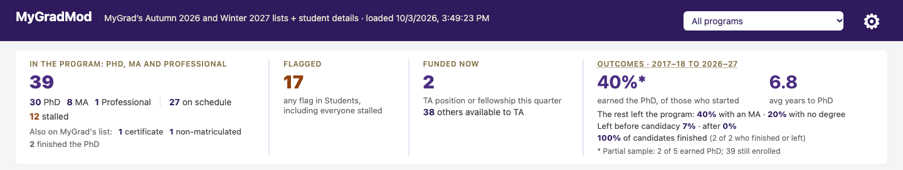
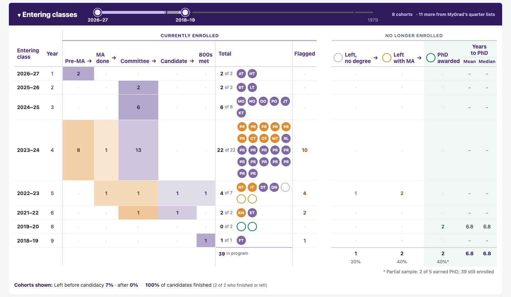
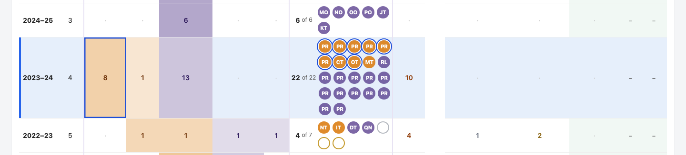
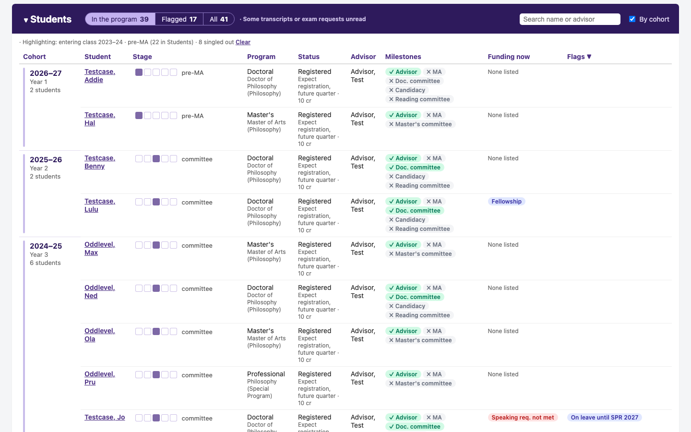
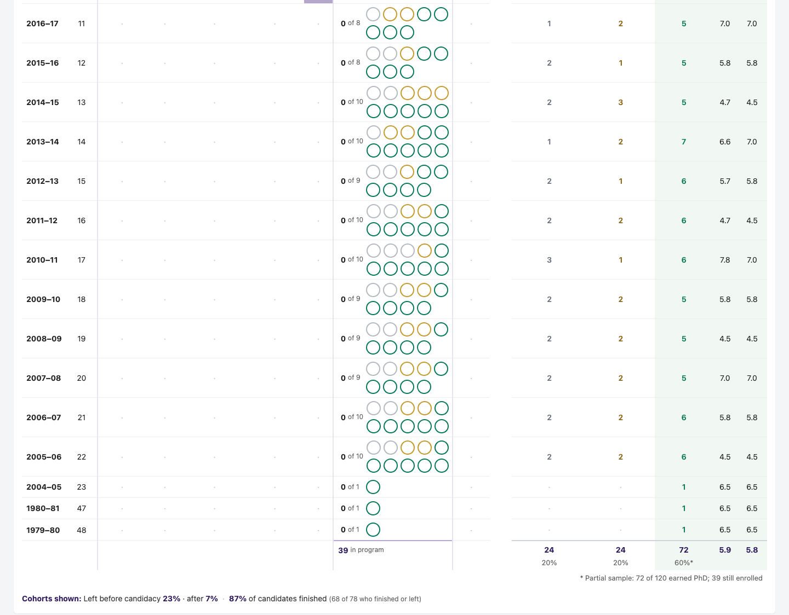
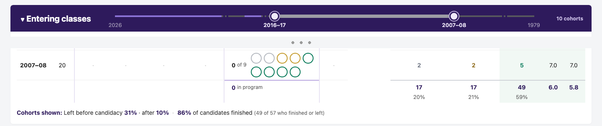

# MyGradMod

A browser bookmarklet for the UW Philosophy graduate program. Run it on **MyGrad → Students → Student Lists → By Quarter** and it opens a dashboard of the whole program:
- a summary of where the program stands
- every entering class's progress and outcomes
- each current student's milestones, flags and funding

It adapts the approach of Ben Marwick's [uw-anthro-web-helpers](https://github.com/benmarwick/uw-anthro-web-helpers) (UW Anthropology), especially his MyGrad Table Audit bookmarklet.

## A Note on Student Privacy and Data Security

**⚠️ Disclaimer & FERPA Warning**:
- This script is an unofficial tool created to assist authorized UW faculty/staff workflows.
- This script accesses FERPA-protected education records.
- Use is restricted to authorized UW faculty/staff with legitimate educational interest.
- This script is not officially supported or endorsed by the University of Washington or the UW Department of Philosophy.
- Users of this tool are solely responsible for ensuring compliance with FERPA and [UW Data Security policies](https://it.uw.edu/policies/security-and-privacy-policies/uw-information-security-policies/).
- Official UW records always take precedence.
- No automated decisions are made about students using this tool.

The script does not collect or use any information about the student outside of MyGrad. The script does not use or contain AI. The data collected by the script are protected by the Family Educational Rights and Privacy Act ([FERPA](https://registrar.washington.edu/staff-faculty/ferpa/)) of 1974 and must not be shared outside of the UW Philosophy advising office without written consent of the student. No data are collected from your computer.

**🔒 A Note on Student Privacy**: Because this repository is public, students or parents may be reading this. Please be assured that student privacy is our highest priority:

-   No AI: This tool does not use or contain AI. No student data are sent to any AI service, public or UW's.
-   No student data in this repository: It contains code only. The screenshots below show made-up students.
-   Expert, Authorised Human Oversight: This dashboard is used strictly as a summarization aide by authorized UW faculty/staff with legitimate educational interests. It does not make decisions regarding student progress, grades, or degree milestones. Its flags are prompts for review: authorised UW faculty/staff verify them against official university records before taking any action.

**How MyGradMod handles student data:**
- **It runs entirely in your browser.** It reads MyGrad data you can already see while logged in, and opens the dashboard in a new tab.
  - Nothing is sent anywhere.
  - Nothing is stored except your display settings: flag thresholds, the classes the slider selects, and which sections are collapsed. These are kept in your browser.
- **It takes only the fields it needs.** It never uses ethnicity, gender, visa status, residency, addresses, emails, NetIDs, student numbers, GRE scores or previous institutions.
- **For current doctoral students, it also reads two of their MyGrad pages: the transcript and the doctoral exam requests page.** It keeps only:
  - the number of dissertation (800) credits, and which quarters they fall in
  - whether candidacy was granted, and the exam date
  - No courses, course titles, grades or committee members reach the dashboard.
- **Former students appear as class totals, and by name only where you look for them.** A former student's name shows in two places:
  - when you hover their dot in Entering classes
  - in the Former students panel, which starts closed every time
  - Either way you see only their name, entering class and outcome, the quarter it happened, their years to degree for PhDs, and whether the record came from MyGrad's quarter lists. Nothing else from their records reaches the dashboard.
  - Showing former students' initials on the dots is an optional setting, off by default.
- **The dashboard's footer repeats the rules:** these are student records protected by FERPA, for authorized faculty and staff only. Don't share or screenshot them outside that group, and close the tab when you're done.
- **It was built and tested without seeing student data.**
  - MyGrad's formats were learned from console checks that printed only field names, value formats or counts.
  - The dashboard was developed against a fake MyGrad with made-up students.
  - **The screenshots below show made-up students only.**

## Requirements

- Using your official UW-issued computer, use your UW credentials to log in to [MyGrad Department View](https://facstaff.grad.uw.edu/mygrad-for-faculty-and-staff/#mygrad-faculty-staff-2). These are FERPA-protected education records and this view is only available to authorized faculty and staff in GPC/GPA roles.
- Google Chrome (the browser it was tested in).

## How to install the bookmarklet

A [bookmarklet](https://en.wikipedia.org/wiki/Bookmarklet) is a bookmark stored in your web browser that contains JavaScript commands that make the browser do useful work. This one only works on sites that require UW credentials to access.

-   For Chrome, look on the top menu bar for "Bookmarks", select "Bookmark Manager"
-   On the very top right of the Bookmarks page, click the three dots to show a drop-down menu, click on "Add new bookmark"
-   For the name field, use 'MyGradMod' or similar (quotes not required)
-   Select all the code in the block under the heading 'Script for the bookmarklet', and paste it into the URL field of the new bookmark box.
-   Click Save to finish making the bookmarklet. Look for the new bookmark in the list of bookmarks top menu bar for "Bookmarks" or on your bookmark bar.

#### Script for the bookmarklet:

```
javascript:(function(){
  var s = document.createElement('script');
  s.src = 'https://cdn.jsdelivr.net/gh/ischnee/MyGradMod@main/bookmarklet-mygradmod.js?t=' + Date.now();
  s.onload = function() { console.log('[Bookmarklet] Script loaded'); };
  s.onerror = function() { console.error('[Bookmarklet] Failed to load script'); };
  document.body.appendChild(s);
})();
```

This short script loads the latest version of MyGradMod from this repository each time you click it, so you never need to reinstall it to get updates.

**Prefer a fixed copy that doesn't update itself?** Download `MyGradMod.html` from this repository and import it in Chrome (Bookmark Manager → three dots → Import bookmarks). To update it later, delete that bookmark and import a newer copy.

## How to use

- Log in to MyGrad Department View as described under Requirements.
- Go to **Students → Student Lists → By Quarter**. Any quarter can be showing: MyGradMod always combines MyGrad's lists for the current and next quarters, and names them in the dashboard's header.
- Click the **MyGradMod** bookmark. The dashboard opens in a new tab. If Chrome blocks it, allow pop-ups for MyGrad.
- Close the dashboard tab when finished.

## What's on the dashboard

- **Program (top bar):** show one program throughout the page, in the summary, Entering classes and Students, or all programs together.
- **Program summary:**
  - Students in the program (PhD and MA), on schedule vs. stalled.
  - Flagged students.
  - Funding this quarter, and others available to TA.
  - Outcomes for the latest 10 cohorts: the share who earned the PhD and average years to PhD.
- **Entering classes:** a slider chooses which cohorts to show. For each cohort, the table shows:
  - where its current students are: pre-MA, MA done, committee, candidate, or "800s met" (a candidate with the 27 dissertation credits the Grad School requires), colored by whether they're on schedule
  - one dot per student who entered: filled if enrolled, a ring colored by outcome if they have left
  - how many are flagged
  - how many left with no degree, left with an MA, or earned the PhD
  - mean and median years to PhD
- **Students:** grouped by cohort, with each student's stage, program, status, advisor, milestones, funding and flags.
  - **Candidacy** counts if the student's doctoral exam requests page shows "Candidacy Granted", or if MyGrad's candidacy field says so.
  - **800 credits** shows a candidate's dissertation credits against the 27 required.
  - Two new flags: a candidate with no 800 credits (probably still registering for 600), and more than 100 credits of 800. Both thresholds are in Settings.
  - Hover a milestone to see where it comes from.
  - Views: In the program, Flagged, All.
  - Search by name or advisor.
  - Clicking a cohort, stage cell or dot highlights those students across the page.
- **Former students:** closed until you open it. It lists everyone who has finished or left, by entering class, with outcome, quarter and years to PhD.
  - Views: All, PhD, Left with MA, Left.
  - Search by name.
  - Clicking a class shows it in Entering classes.
- **Settings (gear icon):** flag thresholds, plus display options.

Hovering explains most numbers in place, e.g. why a cell is marked "stalled".

## Cautions

- **Philosophy-specific defaults.** Flag thresholds follow the 2026–27 Philosophy Graduate Handbook: MA by the end of year 2, doctoral committee by year 3, candidacy by year 4, reading committee by year 4, and the Graduate School's 10-year doctoral and 6-year master's limits. Change them under Settings. Year in program counts from the admission quarter and doesn't subtract leave.
  - **Other departments:** degrees are matched to the department's own field from its degree titles, so it should work beyond Philosophy. For example, "MASTER OF ARTS (ANTHROPOLOGY: BIOLOGICAL)" counts in Anthropology, but a master's in another field doesn't.
- **MyGrad's own data has quirks.** Some students' details come only from older or inactive records, which can be out of date.
  - Examples: a speaking requirement still listed as "Required", or an advisor yes/no field that lags behind the advisor list.
  - The dashboard reads these fields loosely, and hover text shows MyGrad's own value.
  - A flag is a prompt to look, not a finding: **check the student's official MyGrad record before acting.**
- **Counts can differ from MyGrad's list.** Students whose PhD has been awarded can stay on MyGrad's By Quarter list. The dashboard shows them in the entering-class history, not among current students. Hover **All** to see how the count reconciles with MyGrad's.
- **Recent outcomes are partial.** For cohorts with students still enrolled, the PhD share counts only those who have already finished or left, and is marked with an asterisk (\*).
- **The full history takes about a minute.** MyGrad's detail records miss many former students. So once the dashboard is open, MyGradMod also reads every past quarter's list, back to about 1990, and adds the former students found only there. Keep the MyGrad tab open until the Entering classes bar says it's done.
  - **Outcomes:** a PhD is read from a last list entry of "Graduated" with the Doctor of Philosophy title. The lists don't record master's degrees, so the others count as "left, no degree".
  - **Candidacy:** the candidacy lines count only students with MyGrad detail records.
- **Transcripts and exam requests take another half minute or so.** They're read in the background too, and a toast shows the progress. The Students bar says when they're done, and its hover lists any pages that couldn't be read.
  - **Exam requests pages are read one at a time,** because MyGrad keeps the student being viewed in its session.
  - **The org number:** these pages need the department's MyGrad org number, which MyGradMod finds on the By Quarter page. If it can't find it, candidacy comes from MyGrad's records alone, and the hover says so.

## Credit

Reading candidacy from the doctoral exam requests page, and 800 credits from the transcript, follows [Ben Marwick](https://github.com/benmarwick)'s table-audit bookmarklet in [uw-anthro-web-helpers](https://github.com/benmarwick/uw-anthro-web-helpers). He suggested both, and the department-field fix, in [issue #1](https://github.com/ischnee/MyGradMod/issues/1).

## Screenshots (made-up students)











**Checking a historical period.** Drag the slider's two dots to any run of entering classes, here 2007–08 through 2016–17. The table's sum row then gives that period's totals:
- how many left with no degree, left with an MA, or earned the PhD
- the share of each among those who left, which add to 100%
- mean and median years to PhD

Move the dots to another decade to compare.



## For maintainers

- **Every push reaches every user.** Everyone using the loader runs whatever is on `main` in this repository the next time they click, on a page full of FERPA-protected records. Keep write access to people who need it, and protect those GitHub accounts with two-factor authentication.
- **Send updates out right away.** jsDelivr keeps a copy of the file on its servers for up to 12 hours. About a minute after pushing, open `https://purge.jsdelivr.net/gh/ischnee/MyGradMod@main/bookmarklet-mygradmod.js` once, and everyone gets the new version on their next click. (Purging in the first seconds after a push can put the old version straight back, before GitHub reports the new one.) The loader adds a timestamp (`?t=…`) to the address, so browsers never reuse an old copy; without it, jsDelivr tells browsers to keep the file for up to 7 days.
- **Regenerate the import file** `MyGradMod.html` whenever `bookmarklet-mygradmod.js` changes, so the fixed-copy option stays current.
